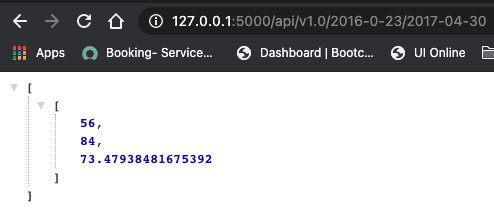

# SQLAlchemy Homework

## Summary
**In this project I had to connect to a sqlite database and extract data for some analysis.  This involved using:**  

*  SQLAlchemy ORM queries
*  Pandas
*  Matplotlib  

**After the analysis, I created a weather app using Flask API based on the queries I developed for the analysis section previously.**  

## Analysis

The first task was to analyze the last 12 months of precipitation from all stations (9 total) and load it into a DataFrame for plotting.  

![precipitation graph](Images/prcp.pn mk 

The second task was to analyze the temperature observations at each station and create a histogram from the data queried.

## Climate App
After creating the queries and graphs, I designed a Flask API to display the query results.
* Flask root directory 

    

* Flask Precipitation  
  

* Flask Stations  
  

* Flask Start Date/ End Date  

## Bonus # 1

### Temperature Analysis 1
Here I had to analyze temperature data to determine if there was a meaninful difference between the temperatures during June and December in Hawaii.  After some querying and data manipulating I came up with some statistical data and performed a paired t-test.  
  
  

**Conclusion**
*With a p-value < 0.05 the means between June and December are statistically significant. Therefore there is a meaningful difference between the temperatures of both months. June is definitely a warmer month to visit.*     

